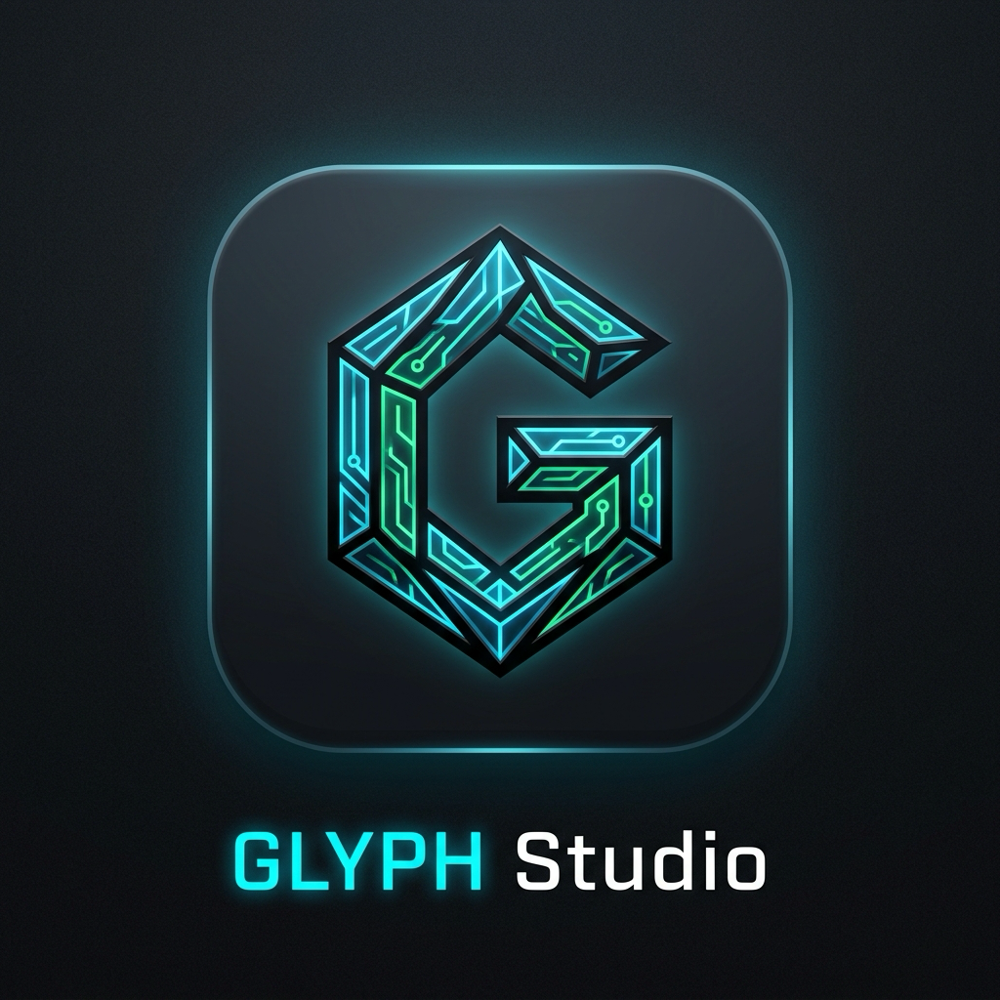

<p align="center">
  
</p>

<h1 align="center">GLYPH Studio</h1>

<p align="center">
  <strong>Native macOS & iOS Typographical Architecture Engine for Signal Mobile Chats</strong><br>
  <em>Zero-wrap monospace geometry, offline NLP classification, and real-time sub-pixel chat physics.</em>
</p>

<p align="center">
  <a href="https://github.com/acts-seven/glyph-studio/releases/tag/v1.0.0"></a>
  
  
  
</p>

---

## ⚡ Overview

**GLYPH Studio** is an ultra-precision native suite for macOS and iOS engineered to transform raw, unstructured catalogs and menus into pristine, monospace-bordered typographic architectures tailored specifically for Signal mobile chat bubbles.

Standard chat messages collapse when rendered on mobile screens due to varying viewport widths, proportional font metrics, and unpredictable text wrapping. GLYPH Studio eliminates text wrapping entirely by enforcing a mathematically verified **$\le 24$ visual column invariant** paired with sub-pixel mobile bubble physics simulation.

---

## 📦 Quick Installation (macOS)

Download and install the sanitized, privately signed macOS `.pkg` installer directly:

```bash
# 1. Download installer and checksum from GitHub release
curl -LO https://github.com/acts-seven/glyph-studio/releases/download/v1.0.0/GLYPH-Studio-v1.0.0.pkg
curl -LO https://github.com/acts-seven/glyph-studio/releases/download/v1.0.0/GLYPH-Studio-v1.0.0.pkg.sha256

# 2. Verify SHA-256 integrity
shasum -a 256 -c GLYPH-Studio-v1.0.0.pkg.sha256

# 3. Install directly into /Applications
sudo installer -pkg GLYPH-Studio-v1.0.0.pkg -target /
```

Or download the standalone portable app archive from the [v1.0.0 Releases Page](https://github.com/acts-seven/glyph-studio/releases/tag/v1.0.0).

---

## 🏛️ Core Architectural Pillars

### 1. Zero-Wrap Mobile Invariant ($\le 24$ Columns)
Signal's iOS and Android chat bubbles impose strict physical constraints:
* **Max Monospace Bubble Width:** 24 visual columns on compact viewports (iPhone SE 3rd gen @ 375pt, standard Android @ 360dp).
* **Automated Wrap Prevention:** Any line exceeding 24 columns triggers automatic truncation, wrapping indicators, and margin re-balancing.

### 2. Eight Calibrated Architectural Themes
* 🏛️ **Obelisk Apex:** Heavy dual-line classical stonework (`╔═╗║╚═╝◈❖`)
* ⚡ **Cyber Conduit:** High-tech circuit conduit brackets (`┌─┐│└─┘█░▒▓`)
* 🔮 **Alchemical Sanctum:** Sacred geometric sigils & diamond dividers (`◈ ✦ ❖ ⟡`)
* 🌀 **Engulfing Vortex:** Dense concentric unicode frames surrounding body text
* 🌌 **Celestial Void:** Airy, ethereal starlight dot grids (`· ˚ ༘ ✦`)
* 👑 **Royal Baroque:** Ornate heraldic filigree (`« » ✤ ❧`)
* ᚱ **Nordic Rune:** Elder Futhark bindrune headers & carved markers
* 🧬 **Procedural Permutations:** Deterministic, generative unicode motif engine

### 3. Offline Semantic Hierarchy NLP
Powered by Apple's `NaturalLanguage` framework (`NLTagger`, `NLTag.lexicalClass`). No cloud dependencies, API keys, or LLM tokens required:
* Classifies unstructured text into: **Master Title**, **Category / Section**, **Subheading / Department**, **Item & Price**, and **Body Text**.
* Automatically structures titles into bold unicode representations, formats prices with aligned right-hand columns, and frames content into cohesive monoliths.

### 4. Real-Time Dual-Pane Studio
* **Left Pane (Composer):** Rich source editor with live keystroke transcoding, theme switching, and hierarchy classification toggles.
* **Right Pane (Signal Mirror):** High-fidelity replica of Signal iOS chat bubble physics, simulating 16pt corner radii, 204pt–294pt dynamic bubble widths, and SF Mono sub-pixel typography.

### 5. Native iOS Custom Keyboard Extension
Embedded full-featured iOS Keyboard Extension (`GLYPHKeyboard`):
* Operates under iOS's strict memory limit (< 30 MB).
* Cycle themes, format clipboard text, and insert verified 24-column typographic layouts directly inside any messaging app without leaving the conversation.

---

## 🛠️ Building From Source

```bash
# Clone the repository
git clone https://github.com/acts-seven/glyph-studio.git
cd glyph-studio

# Run all test invariant suites
make test

# Build Release macOS App Bundle
make build

# Build and package sanitized .pkg installer
make pkg

# Install to /Applications
make install
```

---

## 🔒 Privacy & Security

* **Zero Cloud Analytics / Telemetry:** Operates 100% offline.
* **Sanitized Packaging:** All release binaries and installer packages are stripped of developer paths, local usernames, and host filesystem metadata.
* **Privately Signed:** Ad-hoc code-signed with Apple `codesign` standards.

---

## 📜 License

MIT License. Designed and built with autonomous craftsmanship by [acts-seven](https://github.com/acts-seven).
